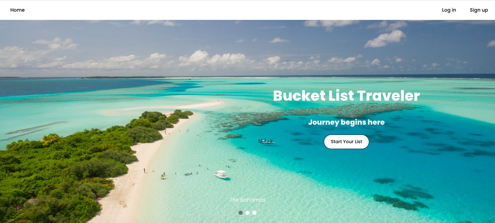
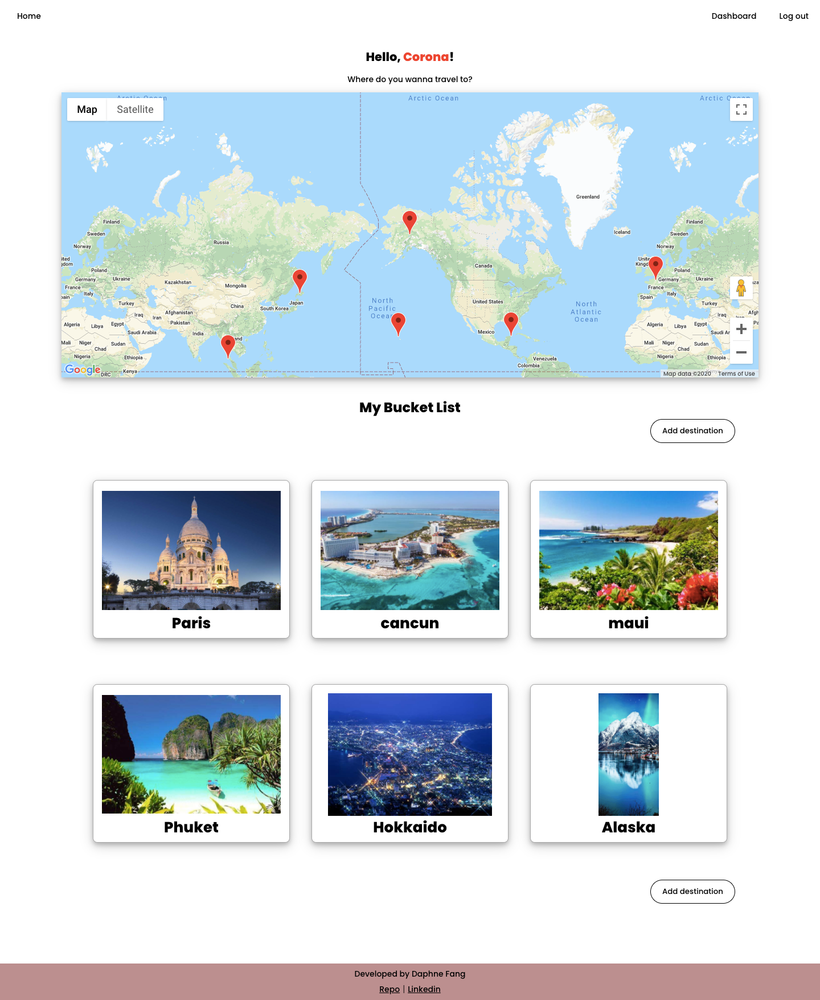
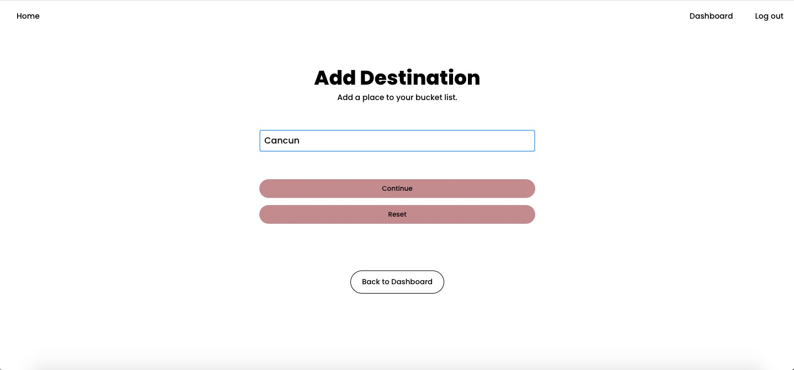
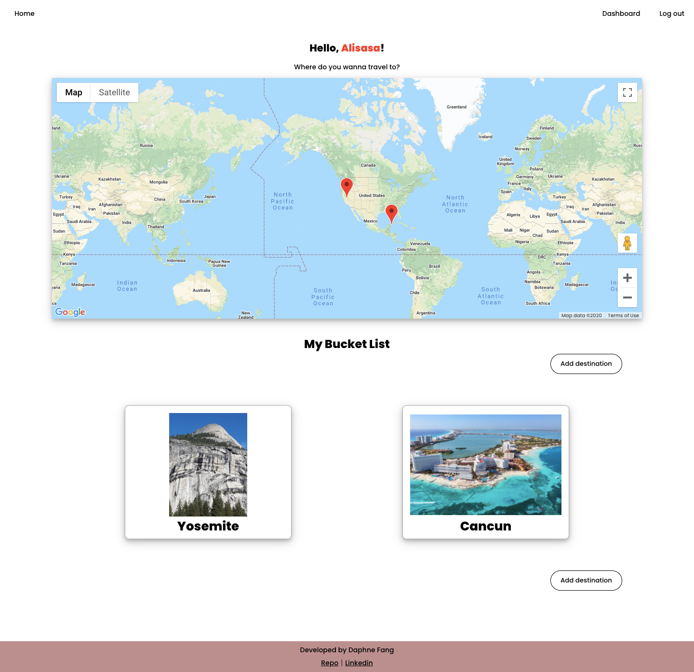
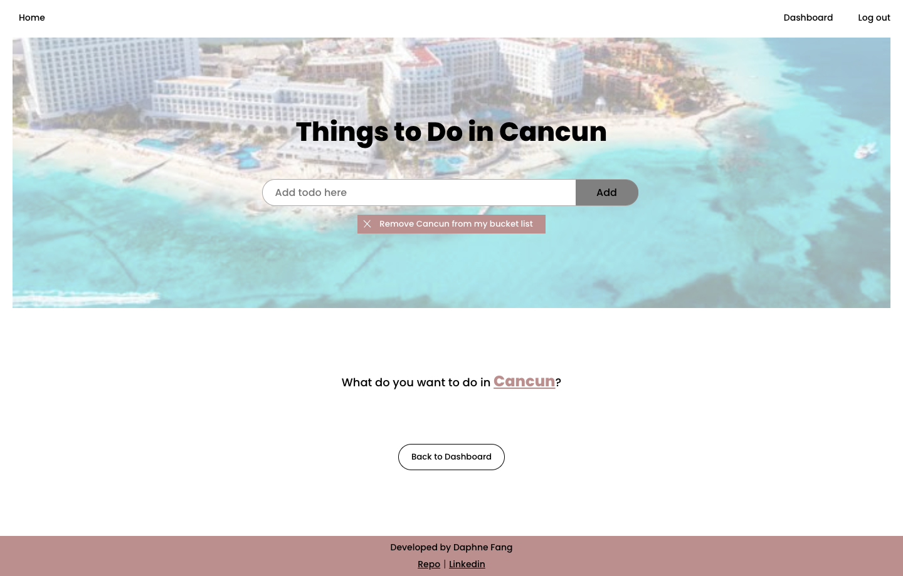

# Bucket List Traveler

Link to Live Demo: https://bucketlist-traveler-app.vercel.app/




## What is Bucket List Traveler?

Travelling seems not likely during the pandemic. By developing this app, desperate tarvellers (like me!) can at least have a list of destinations to dream on, plan on and quench the thirst for flying around. 



## Features

- *Add a destination:* Users can add destinations into the bucket list by entering the name of the location. This app works with Google Place API to fetch location photos. Marker pins of corresponding location dropped to the embedded map on dashboard after adding the location.




- *Add todos:* Users can add/edit/delete/check-off to-do items to the destinations respectively.



- *Authenticaion System:* Users can sign up for the service and create their own personal list. Log in the app to retrieve personal list. Log out feature is also available.

## Technology Used
- React
- JWT
- CSS
- JEST
- Google Place API
- Google Embedded Map API

## API Documentation
Clone this repo to your local machine:

    git clone https://github.com/tacoqqq/bucketlist-traveler-api.git

Base URL:

    https://sheltered-coast-88276.herokuapp.com/api


### Authorization Endpoint:

    /login

need to provide data following this format in the request:

```
    {
        email: 'User registered email',
        password; 'User password'
    }
```

Successful Log in event will issue an token in the response. All endpoints are accessible only with token included in the request body(except for the sign up endpoint /users POST.)


### Authorization token requires in the request body when making requests to below endpoints (unless otherwise noted):

include the below infomration in the request body header:


```
    {
        'Authorization': bearer *token issued*
    }
```

### User Endpoint:

    /users

- GET

successful request will return this data structure:

```
    {
        id: 1,
        email: 'User registered email',
        password: 'User password,
        user_created_time: 2020-08-22 18:21:36.491043+00,
        nickname: 'User nickname
    }
```

- POST

Does not require authorization.
need to provide data following this format in the request:

```
    {
        nickname: 'User nickname',
        email: 'User registered email',
        password: 'User password,
    }
```


### All Destinations Endpoint: 

    /destinations

Available Requests:

- GET

successful request will return this data structure in response:

```
[
    {
        id: 1,
        destination: 'Taipei',
        img: 'google place api photo (url)'
        coordinate: '{"lat":23.6978, "lng":120.9605}',
        user_id: 1,
        destination_created_time: 2020-08-22 18:21:36.491043+00,
    },
    {
        id: 2,
        destination: 'Maldives',
        img: 'google place api photo (url)'
        coordinate: '{"lat":3.2028, "lng":73.2207}',
        user_id: 1,
        destination_created_time: 2020-08-23 18:21:36.491043+00,
    },
    ...
    ...
]
```

- POST

need to provide data following this format in the request body:

```
    {
        destination: 'User entered destination'
    }
```

will return 

`/destinations/3`

```
    {
        id: 3,
        destination: 'User entered destination'
        img: 'google place api photo (url)'
        coordinate: 'Google place api fetched info',
        user_id: 1,
        destination_created_time: 2020-08-23 18:21:36.491043+00,
    },
```

`img` and `coordinate` are fetched by Google Place API
`destination_id` and `destination_created_time` are automatially generated by API.


### One Specific Destination Endpoint: 

    /destinations/:destinationId

Available Requests:

- GET

`/destinations/1` will return this data structure:

```
    {
        id: 1,
        destination: 'Taipei',
        img: 'google place api photo (url)'
        coordinate: '{"lat":23.6978, "lng":120.9605}',
        user_id: 1,
        destination_created_time: 2020-08-22 18:21:36.491043+00,
    }
```

- DELETE

`/destinations/1` will return status code 204

### All Todos Endpoint: 

    /todos

Available Requests:

- GET

successful request will return this data structure in response:

```
    [
         {
            id: 1,
            user_id: 1,
            destination_id: 1,
            content: 'drink boba'
            checked_active: false,
            todo_created_time: 2020-08-22 18:21:36.491043+00,
         },
         {
            id: 2,
            user_id: 1,
            destination_id: 1,
            content: 'eat xiaolongbao'
            checked_active: false,
            todo_created_time: 2020-08-23 18:21:36.491043+00,
         },
         ...
         ...
    ]
```

- POST

need to provide data following this format in the request body:

```
    {
        user_id: 1,
        destination_id: 1,
        content: 'visit night market'
    }
```

* user_id is the id of the logged in user
* destination_id is the id of the target destination

will return 

`/todos/3`

```
    {
        id: 3,
        user_id: 1,
        destination_id: 1,
        content: 'eat xiaolongbao'
        checked_active: false,
        todo_created_time: 2020-08-23 18:21:36.491043+00,
    },
```
`id`, `checked_active` and `todo_created_time` are automatially generated by API.


### All Todos From The Same Destination Endpoint: 

    /todos/destinationId/

Available Requests:

- GET

`/todos/1` will return all todos fall under the same destination following this data structure:

```
    [
        {
            id: 1,
            user_id: 1,
            destination_id: 1,
            content: 'drink boba'
            checked_active: false,
            todo_created_time: 2020-08-22 18:21:36.491043+00,
        },
        {
            id: 2,
            user_id: 1,
            destination_id: 1,
            content: 'eat xiaolongbao'
            checked_active: false,
            todo_created_time: 2020-08-23 18:21:36.491043+00,
        },
        {
            id: 3,
            user_id: 1,
            destination_id: 1,
            content: 'eat xiaolongbao'
            checked_active: false,
            todo_created_time: 2020-08-23 18:21:36.491043+00,
        },
        ...
        ...
    ]               
```


### One Specific Todo Endpoint:

    /todos/destinationId/todoId

Available Requests:

- GET

`/todos/1/1` will return this data structure:

```
    {
        id: 1,
        user_id: 1,
        destination_id: 1,
        content: 'drink boba'
        checked_active: false,
        todo_created_time: 2020-08-22 18:21:36.491043+00,
    }
```

- PATCH

`/todos/1/1` need to provide data following this format:

```
    {
        user_id: 1,
        destination_id: 1,
        content: 'updated content'
        checked_active: 'true or false'
        todo_created_time: 'updated time'
    }
```
*All entries are required data except for `id`.

will return 

`/todos/1/1`

```
    {
        id: 1,
        user_id: 1,
        destination_id: 1,
        content: 'updated content'
        checked_active: 'true or false'
        todo_created_time: 'updated time'
    }
```

- DELETE

`/todos/1/1` will return status code 204